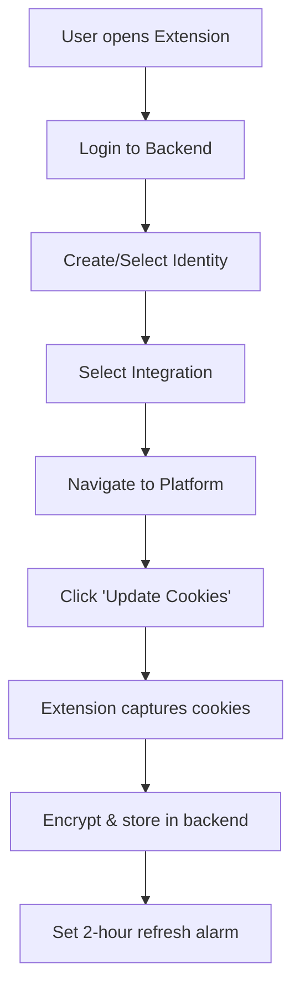
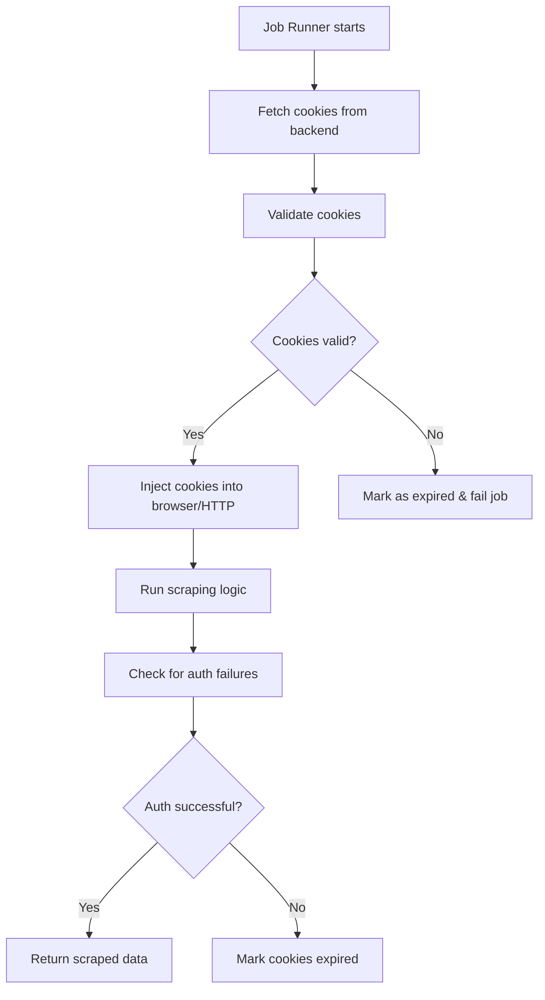

# 🚀 Session Cookie Management Integration Guide

## Overview

This guide shows you how to integrate the multi-identity session cookie management system into your existing scraping tool. The system provides:

- **Chrome Extension**: Automatic cookie capture with 2-hour refresh cycles
- **Backend API**: Encrypted cookie storage and retrieval
- **Scraper Helpers**: Cookie injection for Playwright, Puppeteer, and HTTP clients
- **Multi-Account Support**: Manage multiple identities across LinkedIn, Sales Navigator, Twitter/X

## 📁 File Structure

```
your-scraping-tool/
├── extension/                     # Chrome Extension
│   ├── manifest.json             # Extension configuration
│   ├── enhanced-background.js     # Background script with cookie management
│   ├── enhanced-popup.html        # Multi-identity UI
│   ├── enhanced-popup.js          # UI logic
│   └── icons/                     # Extension icons
├── backend/
│   ├── cookie-api.js              # Cookie storage API routes
│   ├── scraper-helpers.js         # Cookie injection helpers
│   └── working-server.js          # Your existing server (modified)
└── scrapers/
    ├── linkedin-scraper.js        # Your LinkedIn scraper (modified)
    ├── twitter-scraper.js         # Your Twitter scraper (modified)
    └── job-runner.js              # Your job runner (modified)
```

## 🔧 Integration Steps

### Step 1: Backend Integration

#### 1.1 Install Dependencies

```bash
npm install crypto mysql2 jsonwebtoken uuid
```

#### 1.2 Add Cookie API to Your Server

In your main server file (e.g., `server.js` or `app.js`):

```javascript
// Add after your existing imports
const { router: cookieRouter } = require('./cookie-api');

// Add after your existing middleware
app.use('/api', cookieRouter);
```

#### 1.3 Environment Variables

Add to your `.env` file:

```env
# Cookie encryption (generate a 32-character key)
ENCRYPTION_KEY=your-32-character-secret-key-here!

# Database configuration (if not already set)
DB_HOST=localhost
DB_PORT=3306
DB_USER=root
DB_PASSWORD=your-password
DB_NAME=your-database

# JWT secret (if not already set)
JWT_SECRET=your-jwt-secret-key
```

### Step 2: Chrome Extension Setup

#### 2.1 Load Extension in Chrome

1. Open Chrome and go to `chrome://extensions/`
2. Enable "Developer mode" (top-right toggle)
3. Click "Load unpacked"
4. Select the `extension` folder
5. Pin the extension to your toolbar

#### 2.2 Update Manifest (if needed)

Update `manifest.json` to use the enhanced version:

```json
{
  "manifest_version": 3,
  "name": "Multi-Identity Cookie Manager",
  "version": "2.0.0",
  "description": "Advanced session cookie management for multiple accounts",
  
  "permissions": [
    "activeTab",
    "cookies",
    "storage",
    "tabs",
    "scripting",
    "background",
    "alarms"
  ],
  
  "host_permissions": [
    "https://*.linkedin.com/*",
    "https://*.twitter.com/*",
    "https://*.x.com/*",
    "http://localhost:*/*"
  ],
  
  "background": {
    "service_worker": "enhanced-background.js",
    "type": "module"
  },
  
  "action": {
    "default_popup": "enhanced-popup.html",
    "default_title": "Cookie Manager"
  }
}
```

### Step 3: Scraper Integration

#### 3.1 Playwright Integration

```javascript
// linkedin-scraper-playwright.js
const { chromium } = require('playwright');
const { injectCookiesForJob } = require('./scraper-helpers');

class LinkedInScraperPlaywright {
  async scrapeProfile(profileUrl, jobConfig) {
    const browser = await chromium.launch({ headless: false });
    const context = await browser.newContext();
    
    try {
      // 🍪 Inject cookies before scraping
      const cookieResult = await injectCookiesForJob({
        identityUid: jobConfig.identityUid,
        integrationUid: 'linkedin',
        apiBaseUrl: 'http://localhost:5000/api',
        authToken: jobConfig.authToken,
        browserType: 'playwright'
      }, context);
      
      console.log(`✅ Cookies injected: ${cookieResult.cookieCount} cookies`);
      
      // Your existing scraping logic
      const page = await context.newPage();
      await page.goto(profileUrl);
      
      // Check if login is required
      if (await page.locator('text=Sign in').isVisible()) {
        throw new Error('Authentication failed - cookies may be expired');
      }
      
      // Your scraping logic here
      const profileData = await page.evaluate(() => {
        return {
          name: document.querySelector('h1')?.textContent,
          headline: document.querySelector('.text-body-medium')?.textContent,
          // ... your extraction logic
        };
      });
      
      return profileData;
      
    } finally {
      await browser.close();
    }
  }
}

module.exports = LinkedInScraperPlaywright;
```

#### 3.2 Puppeteer Integration

```javascript
// linkedin-scraper-puppeteer.js
const puppeteer = require('puppeteer');
const { applyCookiesToPuppeteer, fetchCookiesFromBackend } = require('./scraper-helpers');

class LinkedInScraperPuppeteer {
  async scrapeProfile(profileUrl, jobConfig) {
    const browser = await puppeteer.launch({ headless: false });
    const page = await browser.newPage();
    
    try {
      // 🍪 Fetch and apply cookies
      const cookies = await fetchCookiesFromBackend(
        jobConfig.identityUid,
        'linkedin',
        'http://localhost:5000/api',
        jobConfig.authToken
      );
      
      await applyCookiesToPuppeteer(page, cookies, 'linkedin');
      console.log(`✅ Applied ${cookies.length} cookies to Puppeteer`);
      
      // Your existing scraping logic
      await page.goto(profileUrl);
      
      // Check authentication
      const isLoginPage = await page.$('input[name="session_key"]');
      if (isLoginPage) {
        throw new Error('Authentication failed - cookies may be expired');
      }
      
      // Your scraping logic here
      const profileData = await page.evaluate(() => {
        return {
          name: document.querySelector('h1')?.textContent,
          headline: document.querySelector('.text-body-medium')?.textContent,
          // ... your extraction logic
        };
      });
      
      return profileData;
      
    } finally {
      await browser.close();
    }
  }
}

module.exports = LinkedInScraperPuppeteer;
```

#### 3.3 HTTP/Axios Integration

```javascript
// linkedin-scraper-http.js
const axios = require('axios');
const { getCookieHeader, fetchCookiesFromBackend, validateCookies } = require('./scraper-helpers');

class LinkedInScraperHTTP {
  async scrapeProfile(profileUrl, jobConfig) {
    try {
      // 🍪 Fetch cookies from backend
      const cookies = await fetchCookiesFromBackend(
        jobConfig.identityUid,
        'linkedin',
        'http://localhost:5000/api',
        jobConfig.authToken
      );
      
      // Validate cookies
      const validation = await validateCookies(cookies, 'linkedin');
      if (!validation.isValid) {
        throw new Error(`Cookie validation failed: ${validation.message}`);
      }
      
      // Generate cookie header
      const cookieHeader = getCookieHeader(cookies, 'linkedin.com');
      console.log(`✅ Using ${cookies.length} cookies for HTTP requests`);
      
      // Create axios instance with cookies
      const client = axios.create({
        headers: {
          'Cookie': cookieHeader,
          'User-Agent': 'Mozilla/5.0 (Windows NT 10.0; Win64; x64) AppleWebKit/537.36',
          'Accept': 'text/html,application/xhtml+xml,application/xml;q=0.9,*/*;q=0.8',
          'Accept-Language': 'en-US,en;q=0.5',
          'Accept-Encoding': 'gzip, deflate',
          'Connection': 'keep-alive',
          'Upgrade-Insecure-Requests': '1'
        },
        timeout: 30000,
        maxRedirects: 5
      });
      
      // Make request
      const response = await client.get(profileUrl);
      
      // Check if redirected to login
      if (response.request.res.responseUrl.includes('/login') || 
          response.data.includes('Sign in to LinkedIn')) {
        throw new Error('Authentication failed - redirected to login');
      }
      
      // Parse HTML (you can use cheerio or similar)
      const cheerio = require('cheerio');
      const $ = cheerio.load(response.data);
      
      const profileData = {
        name: $('h1').first().text().trim(),
        headline: $('.text-body-medium').first().text().trim(),
        // ... your extraction logic
      };
      
      return profileData;
      
    } catch (error) {
      console.error('❌ HTTP scraping failed:', error.message);
      throw error;
    }
  }
}

module.exports = LinkedInScraperHTTP;
```

### Step 4: Job Runner Integration

#### 4.1 Enhanced Job Runner

```javascript
// job-runner.js
const { validateCookies } = require('./scraper-helpers');
const LinkedInScraperPlaywright = require('./linkedin-scraper-playwright');
const TwitterScraperHTTP = require('./twitter-scraper-http');

class JobRunner {
  constructor(config) {
    this.config = config;
    this.scrapers = {
      linkedin: new LinkedInScraperPlaywright(),
      twitter: new TwitterScraperHTTP()
    };
  }
  
  async runJob(jobData) {
    try {
      console.log(`🚀 Starting job: ${jobData.id}`);
      
      // Prepare job configuration with identity
      const jobConfig = {
        identityUid: jobData.identityUid,
        integrationUid: jobData.platform, // 'linkedin', 'twitter', etc.
        apiBaseUrl: this.config.apiBaseUrl,
        authToken: this.config.authToken,
        ...jobData
      };
      
      // Select appropriate scraper
      const scraper = this.scrapers[jobData.platform];
      if (!scraper) {
        throw new Error(`No scraper available for platform: ${jobData.platform}`);
      }
      
      // Run scraping job
      const result = await scraper.scrapeProfile(jobData.targetUrl, jobConfig);
      
      console.log(`✅ Job completed: ${jobData.id}`);
      return {
        success: true,
        jobId: jobData.id,
        data: result,
        completedAt: new Date()
      };
      
    } catch (error) {
      console.error(`❌ Job failed: ${jobData.id}`, error.message);
      
      // Handle cookie expiration
      if (error.message.includes('Authentication failed') || 
          error.message.includes('cookies may be expired')) {
        
        // Mark cookies as expired in backend
        await this.markCookiesExpired(jobData.identityUid, jobData.platform);
        
        return {
          success: false,
          jobId: jobData.id,
          error: 'Authentication failed - cookies expired',
          requiresCookieRefresh: true,
          completedAt: new Date()
        };
      }
      
      return {
        success: false,
        jobId: jobData.id,
        error: error.message,
        completedAt: new Date()
      };
    }
  }
  
  async markCookiesExpired(identityUid, integrationUid) {
    try {
      await axios.put(
        `${this.config.apiBaseUrl}/identities/${identityUid}/integrations/${integrationUid}/cookies/validate`,
        {
          status: 'expired',
          message: 'Cookies expired during scraping job'
        },
        {
          headers: { 'Authorization': `Bearer ${this.config.authToken}` }
        }
      );
      
      console.log(`⚠️ Marked cookies as expired: ${identityUid}/${integrationUid}`);
    } catch (error) {
      console.error('❌ Failed to mark cookies as expired:', error.message);
    }
  }
  
  // Batch job processing with identity rotation
  async runBatchJobs(jobs) {
    const results = [];
    
    for (const job of jobs) {
      try {
        const result = await this.runJob(job);
        results.push(result);
        
        // Add delay between jobs to avoid rate limiting
        await new Promise(resolve => setTimeout(resolve, 2000));
        
      } catch (error) {
        results.push({
          success: false,
          jobId: job.id,
          error: error.message
        });
      }
    }
    
    return results;
  }
}

module.exports = JobRunner;
```

#### 4.2 Usage Example

```javascript
// main.js - How to use the enhanced job runner
const JobRunner = require('./job-runner');

async function main() {
  const jobRunner = new JobRunner({
    apiBaseUrl: 'http://localhost:5000/api',
    authToken: 'your-jwt-token-here'
  });
  
  // Example jobs with different identities
  const jobs = [
    {
      id: 'job-1',
      platform: 'linkedin',
      identityUid: 'identity_1234567890_abc123',
      targetUrl: 'https://www.linkedin.com/in/johndoe',
      type: 'profile_scraping'
    },
    {
      id: 'job-2',
      platform: 'twitter',
      identityUid: 'identity_0987654321_def456',
      targetUrl: 'https://twitter.com/johndoe',
      type: 'profile_scraping'
    }
  ];
  
  // Run jobs
  const results = await jobRunner.runBatchJobs(jobs);
  
  console.log('📊 Batch job results:');
  results.forEach(result => {
    console.log(`${result.success ? '✅' : '❌'} Job ${result.jobId}: ${result.success ? 'Success' : result.error}`);
  });
}

main().catch(console.error);
```

## 🔄 Workflow

### 1. Cookie Collection Workflow



### 2. Scraping Job Workflow



## 🔧 Configuration

### Backend Configuration

```javascript
// config/cookie-config.js
module.exports = {
  encryption: {
    algorithm: 'aes-256-gcm',
    keyLength: 32
  },
  
  refresh: {
    intervalMinutes: 120, // 2 hours
    retryAttempts: 3,
    retryDelayMs: 5000
  },
  
  validation: {
    timeoutMs: 10000,
    maxRedirects: 5,
    userAgent: 'Mozilla/5.0 (Windows NT 10.0; Win64; x64) AppleWebKit/537.36'
  },
  
  integrations: {
    linkedin: {
      domains: ['.linkedin.com'],
      requiredCookies: ['li_at'],
      testUrl: 'https://www.linkedin.com/feed/'
    },
    twitter: {
      domains: ['.twitter.com', '.x.com'],
      requiredCookies: ['auth_token'],
      testUrl: 'https://twitter.com/home'
    }
  }
};
```

## 🚨 Error Handling

### Common Issues and Solutions

#### 1. "Receiving end does not exist" Error

**Cause**: Extension background script not loaded or crashed

**Solution**:
```javascript
// In popup.js - Add retry logic
function sendMessage(message, retries = 3) {
  return new Promise((resolve, reject) => {
    const attemptSend = (attempt) => {
      chrome.runtime.sendMessage(message, (response) => {
        if (chrome.runtime.lastError) {
          if (attempt < retries) {
            setTimeout(() => attemptSend(attempt + 1), 1000);
          } else {
            reject(new Error(chrome.runtime.lastError.message));
          }
        } else {
          resolve(response);
        }
      });
    };
    attemptSend(1);
  });
}
```

#### 2. Cookie Validation Failures

**Cause**: Cookies expired or platform changed authentication

**Solution**:
```javascript
// Automatic cookie refresh on validation failure
if (validationResult.reason === 'expired_cookies') {
  console.log('🔄 Cookies expired, triggering refresh...');
  await chrome.runtime.sendMessage({
    action: 'updateCookies',
    identityUid: jobConfig.identityUid,
    integrationUid: jobConfig.integrationUid
  });
}
```

#### 3. Database Connection Issues

**Cause**: MySQL connection problems or missing tables

**Solution**:
```javascript
// Add connection retry logic in cookie-api.js
async function initializeDatabase(retries = 3) {
  for (let attempt = 1; attempt <= retries; attempt++) {
    try {
      db = await mysql.createConnection(dbConfig);
      await createTables();
      console.log('✅ Database initialized');
      return;
    } catch (error) {
      console.error(`❌ Database init attempt ${attempt} failed:`, error.message);
      if (attempt === retries) throw error;
      await new Promise(resolve => setTimeout(resolve, 5000));
    }
  }
}
```

## 🔒 Security Best Practices

### 1. Cookie Encryption

```javascript
// Generate secure encryption key
const crypto = require('crypto');
const encryptionKey = crypto.randomBytes(32).toString('hex');
console.log('ENCRYPTION_KEY=' + encryptionKey);
```

### 2. Environment Variables

```bash
# .env - Never commit to version control
ENCRYPTION_KEY=your-generated-32-char-key
JWT_SECRET=your-jwt-secret
DB_PASSWORD=your-secure-db-password
```

### 3. HTTPS Enforcement

```javascript
// In your server configuration
if (process.env.NODE_ENV === 'production') {
  app.use((req, res, next) => {
    if (req.header('x-forwarded-proto') !== 'https') {
      res.redirect(`https://${req.header('host')}${req.url}`);
    } else {
      next();
    }
  });
}
```

## 📊 Monitoring and Logging

### 1. Cookie Status Dashboard

```javascript
// Add to your existing dashboard
app.get('/api/cookie-status', authenticateToken, async (req, res) => {
  const [rows] = await db.execute(`
    SELECT 
      i.name as identity_name,
      ic.integration_uid,
      ic.cookie_count,
      ic.validation_status,
      ic.last_validated,
      ic.updated_at,
      ic.expires_at
    FROM identities i
    LEFT JOIN identity_cookies ic ON i.id = ic.identity_id
    WHERE i.user_id = ?
    ORDER BY ic.updated_at DESC
  `, [req.user.id]);
  
  res.json({ success: true, data: rows });
});
```

### 2. Job Success Metrics

```javascript
// Track job success rates by identity
const jobMetrics = {
  totalJobs: 0,
  successfulJobs: 0,
  failedJobs: 0,
  cookieFailures: 0,
  
  recordSuccess() {
    this.totalJobs++;
    this.successfulJobs++;
  },
  
  recordFailure(isCookieIssue = false) {
    this.totalJobs++;
    this.failedJobs++;
    if (isCookieIssue) this.cookieFailures++;
  },
  
  getSuccessRate() {
    return this.totalJobs > 0 ? (this.successfulJobs / this.totalJobs) * 100 : 0;
  }
};
```

## 🎯 Testing

### 1. Extension Testing

```javascript
// test-extension.js
const assert = require('assert');

// Test cookie collection
async function testCookieCollection() {
  const response = await chrome.runtime.sendMessage({
    action: 'updateCookies',
    identityUid: 'test-identity',
    integrationUid: 'linkedin'
  });
  
  assert(response.success, 'Cookie collection should succeed');
  assert(response.cookieCount > 0, 'Should collect at least one cookie');
  console.log('✅ Cookie collection test passed');
}
```

### 2. API Testing

```javascript
// test-api.js
const axios = require('axios');

async function testCookieAPI() {
  const testCookies = [
    { name: 'li_at', value: 'test-value', domain: '.linkedin.com' }
  ];
  
  // Test store cookies
  const storeResponse = await axios.post(
    'http://localhost:5000/api/priv/identities/test-id/integrations/linkedin/cookies',
    { cookies: testCookies },
    { headers: { 'Authorization': 'Bearer test-token' } }
  );
  
  assert(storeResponse.data.success, 'Should store cookies successfully');
  
  // Test retrieve cookies
  const retrieveResponse = await axios.get(
    'http://localhost:5000/api/identities/test-id/integrations/linkedin/cookies',
    { headers: { 'Authorization': 'Bearer test-token' } }
  );
  
  assert(retrieveResponse.data.success, 'Should retrieve cookies successfully');
  console.log('✅ Cookie API test passed');
}
```

## 🚀 Deployment

### 1. Production Checklist

- [ ] Generate secure encryption keys
- [ ] Set up HTTPS certificates
- [ ] Configure database with proper indexes
- [ ] Set up monitoring and alerting
- [ ] Test cookie refresh cycles
- [ ] Verify all integrations work
- [ ] Set up backup procedures

### 2. Environment Setup

```bash
# Production environment variables
export NODE_ENV=production
export ENCRYPTION_KEY=your-production-key
export JWT_SECRET=your-production-jwt-secret
export DB_HOST=your-production-db-host
export DB_PASSWORD=your-production-db-password
```

## 📞 Support

If you encounter issues during integration:

1. **Check the console logs** in both extension and backend
2. **Verify database connections** and table creation
3. **Test cookie collection** manually through the extension
4. **Validate API endpoints** using Postman or curl
5. **Check authentication tokens** and permissions

---

**🎉 Your scraping tool now has enterprise-grade session management with automatic cookie refresh, multi-identity support, and robust error handling!**